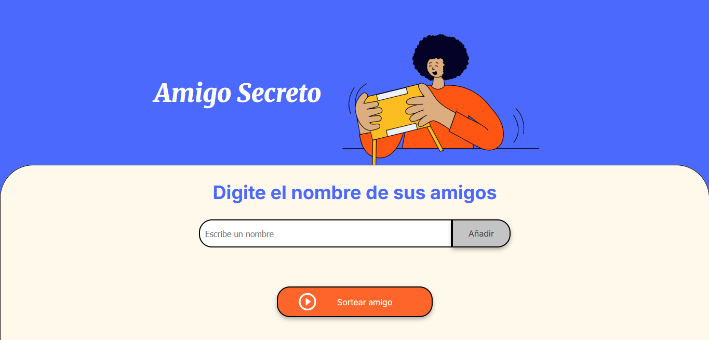
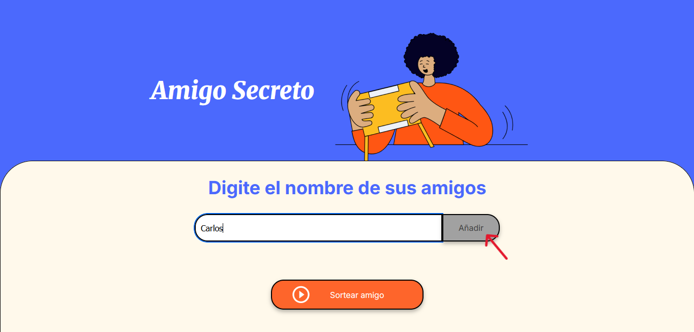
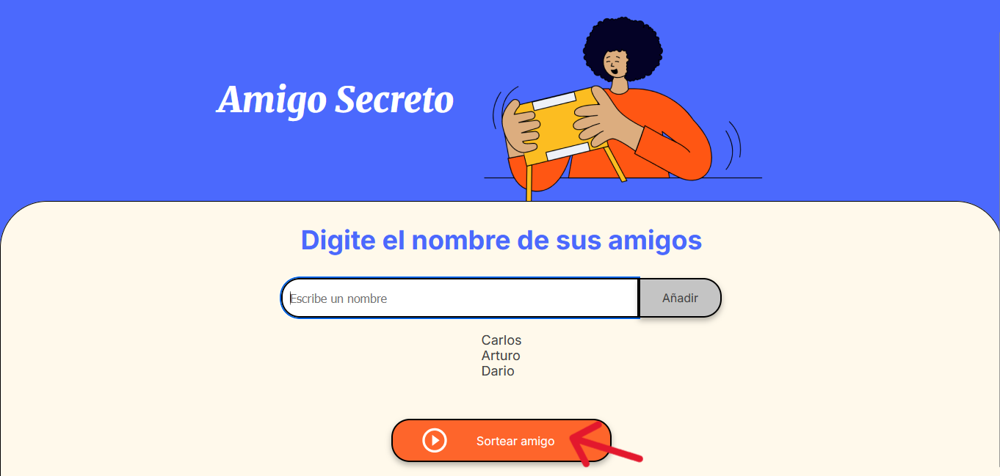
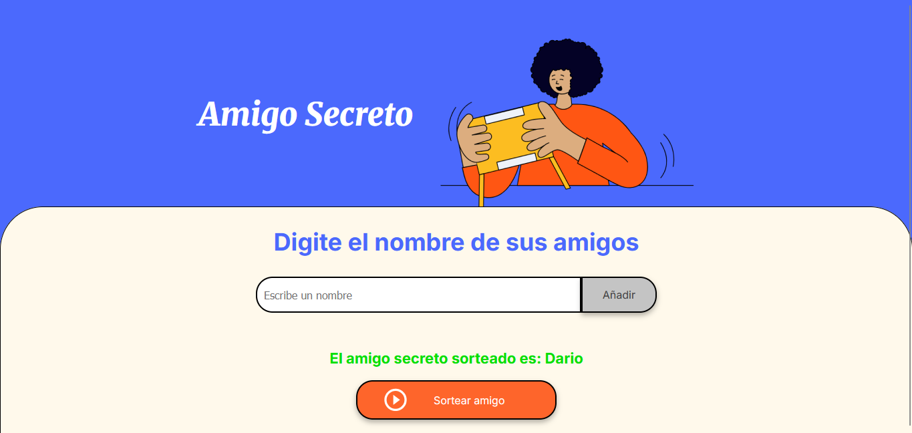

# Amigo Secreto Challenge

Este proyecto es la solución del Challenge de Alura

## Características

- Registro de participantes.
- Sorteo de los participante
- Interfaz amigable y fácil de usar.

## Herramientas

- **HTML**
- **CSS**
- **JS**

## Descargarlo

1. Clona este repositorio:
   ```bash
   git clone https://github.com/LMR04/challenge-amigo-secreto.git
   ```
2. Navega al directorio del proyecto:
   ```bash
   cd challenge-amigo-secreto
   ```
3. Abre el archivo principal:
   ```bash
   index.html
   ```
4. Y listo! Ya lo tienes en tu navegador

## Uso

1. Interfaz inicial
   

2. Agregar un participante
   

3. Sortear de la lista de participantes
   

4. Resultado
   
